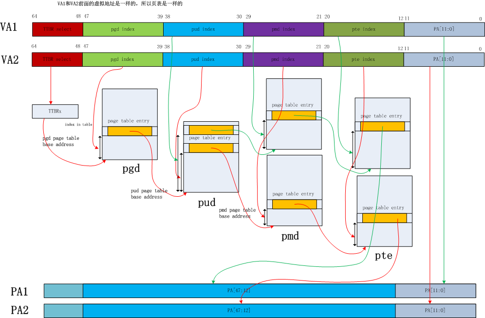

# create_mapping

```c
static void __init __map_memblock(phys_addr_t start, phys_addr_t end)
{
	create_mapping(start, __phys_to_virt(start), end - start,
			PAGE_KERNEL_EXEC);
}
```

```c
/**
 * phys:物理地址
 * virt：虚拟地址
 * size：需要映射地址的大小
 * prot：映射的属性，比如可执行，是否cache等等
 */
static void __ref create_mapping(phys_addr_t phys, unsigned long virt,
				  phys_addr_t size, pgprot_t prot)
{
	if (virt < VMALLOC_START) {
		pr_warn("BUG: not creating mapping for %pa at 0x%016lx - outside kernel range\n",
			&phys, virt);
		return;
	}
    /* pgd_offset_k,获取虚拟地址在pgd中对应项index的虚拟地址，pgd + pgd_index(addr) */
	__create_mapping(&init_mm, pgd_offset_k(virt & PAGE_MASK), phys, virt,
			 size, prot, early_alloc);
}
```

## pgd_offset_k

```c
/* to find an entry in a kernel page-table-directory */
#define pgd_offset_k(addr)	pgd_offset(&init_mm, addr)

/* to find an entry in a page-table-directory */
#define pgd_index(addr)		(((addr) >> PGDIR_SHIFT) & (PTRS_PER_PGD - 1))
/* init_mm.pgd = swapper_pg_dir */
#define pgd_offset(mm, addr)	((mm)->pgd+pgd_index(addr))
```

## __create_mapping

```c
/*
 * Create the page directory entries and any necessary page tables for the
 * mapping specified by 'md'.
 */
static void  __create_mapping(struct mm_struct *mm, pgd_t *pgd,
				    phys_addr_t phys, unsigned long virt,
				    phys_addr_t size, pgprot_t prot,
				    void *(*alloc)(unsigned long size))
{
	unsigned long addr, length, end, next;
	/* 虚拟地址起始地址 */
	addr = virt & PAGE_MASK;
    /* 对齐之后的长度 */
	length = PAGE_ALIGN(size + (virt & ~PAGE_MASK));
	/* 虚拟地址的结束地址 */
	end = addr + length;
	do {
        /* pgd_addr_end返回addr + pgd映射的大小 */
        next = pgd_addr_end(addr, end);
        alloc_init_pud(mm, pgd, addr, next, phys, prot, alloc);
        phys += next - addr;
     /* 
      * 逗号运算符，表达式的值为最后一个表达式的值，即addr != end 
      * 可以看出一次映射，至少映射pgd size的大小。
      */
	} while (pgd++, addr = next, addr != end);
}
```

```c
#define pgd_addr_end(addr, end)						\
({	unsigned long __boundary = ((addr) + PGDIR_SIZE) & PGDIR_MASK;	\
	(__boundary - 1 < (end) - 1)? __boundary: (end);		\
})
```

### alloc_init_pud

```c
static void alloc_init_pud(struct mm_struct *mm, pgd_t *pgd,
				  unsigned long addr, unsigned long end,
				  phys_addr_t phys, pgprot_t prot,
				  void *(*alloc)(unsigned long size))
{
	pud_t *pud;
	unsigned long next;
	/* 如果pgd中virt的index项是空的，则表示pud页表是不存在的，该pgd中保存有pud页表base地址 */
	if (pgd_none(*pgd)) {
         /* 分配一个pud页表 */
		pud = alloc(PTRS_PER_PUD * sizeof(pud_t));
         /* 将该pud页表写入到pgd中对象index的项中 */
		pgd_populate(mm, pgd, pud);
	}
	BUG_ON(pgd_bad(*pgd));
	/* 返回该virt index对应的项在pud页表中的地址 */
	pud = pud_offset(pgd, addr);
	do {
         /* 返回addr + pud映射的大小 */       
		next = pud_addr_end(addr, end);
		/*
		 * For 4K granule only, attempt to put down a 1GB block
		 * 我们不分析使用use_1G_block进行映射
		 */
		if (use_1G_block(addr, next, phys)) {
			pud_t old_pud = *pud;
			set_pud(pud, __pud(phys | pgprot_val(mk_sect_prot(prot))));

			/*
			 * If we have an old value for a pud, it will
			 * be pointing to a pmd table that we no longer
			 * need (from swapper_pg_dir).
			 *
			 * Look up the old pmd table and free it.
			 */
			if (!pud_none(old_pud)) {
				flush_tlb_all();
				if (pud_table(old_pud)) {
					phys_addr_t table = __pa(pmd_offset(&old_pud, 0));
					if (!WARN_ON_ONCE(slab_is_available()))
						memblock_free(table, PAGE_SIZE);
				}
			}
		} else {
			alloc_init_pmd(mm, pud, addr, next, phys, prot, alloc);
		}
		phys += next - addr;
	} while (pud++, addr = next, addr != end);
}
```

#### pgd_none

```c
#define pgd_val(x)	((x).pgd)
#define pgd_none(pgd)		(!pgd_val(pgd))
```

#### pgd_populate

```c
static inline void pgd_populate(struct mm_struct *mm, pgd_t *pgd, pud_t *pud)
{
    /* __pa(pud):pud对应的物理地址，PUD_TYPE_TABLE：页表的类型,__pgd:什么也不做 */
	set_pgd(pgd, __pgd(__pa(pud) | PUD_TYPE_TABLE));
}
```

##### set_pgd

```c
static inline void set_pgd(pgd_t *pgdp, pgd_t pgd)
{
	*pgdp = pgd;
	dsb(ishst);
}
```

#### pud_offset

```c
/* Find an entry in the frst-level page table. */
#define pud_index(addr)		(((addr) >> PUD_SHIFT) & (PTRS_PER_PUD - 1))

static inline pud_t *pud_offset(pgd_t *pgd, unsigned long addr)
{
    /* *pgd表示pud的物理地址， pgd_page_vaddr将其转换为虚拟地址*/
	return (pud_t *)pgd_page_vaddr(*pgd) + pud_index(addr);
}
```

##### pgd_page_vaddr

```c
static inline pud_t *pgd_page_vaddr(pgd_t pgd)
{
	return __va(pgd_val(pgd) & PHYS_MASK & (s32)PAGE_MASK);
}
```

#### alloc_init_pmd

```c
static void alloc_init_pmd(struct mm_struct *mm, pud_t *pud, unsigned long addr, 
					unsigned long end, phys_addr_t phys, pgprot_t prot,
					void *(*alloc)(unsigned long size))
{
	pmd_t *pmd;
	unsigned long next;
	/*
	 * Check for initial section mappings in the pgd/pud and remove them.
	 * 如果pud为空，或者pud的类型为section映射
	 */
	if (pud_none(*pud) || pud_sect(*pud)) {
         /* 分配一个pmd页表 */
		pmd = alloc(PTRS_PER_PMD * sizeof(pmd_t));
         /* 如果是section映射，则进行分拆，我们不考虑该情况 */
		if (pud_sect(*pud)) {
			/*
			 * need to have the 1G of mappings continue to be
			 * present
			 */
			split_pud(pud, pmd);
		}
         /* 将该pmd页表基地址保存到pud页表中virt对应index的项中 */
		pud_populate(mm, pud, pmd);
         /* 为什么要刷所有的tlb */
		flush_tlb_all();
	}
	BUG_ON(pud_bad(*pud));
	/* 返回该virt在pmd页表中，index对应的项的虚拟地址 */
	pmd = pmd_offset(pud, addr);
	do {
         /* 返回addr + pmd映射的大小 */
		next = pmd_addr_end(addr, end);
		/* try section mapping first 我们不关心section映射 */
		if (((addr | next | phys) & ~SECTION_MASK) == 0) {
			pmd_t old_pmd =*pmd;
			set_pmd(pmd, __pmd(phys | pgprot_val(mk_sect_prot(prot))));
			/*
			 * Check for previous table entries created during
			 * boot (__create_page_tables) and flush them.
			 */
			if (!pmd_none(old_pmd)) {
				flush_tlb_all();
				if (pmd_table(old_pmd)) {
					phys_addr_t table = __pa(pte_offset_map(&old_pmd, 0));
					if (!WARN_ON_ONCE(slab_is_available()))
						memblock_free(table, PAGE_SIZE);
				}
			}
		} else {
			alloc_init_pte(pmd, addr, next, __phys_to_pfn(phys), prot, alloc);
		}
		phys += next - addr;
	} while (pmd++, addr = next, addr != end);
}

```

```c
static inline void pud_populate(struct mm_struct *mm, pud_t *pud, pmd_t *pmd)
{
    /* 奖盖pmd页表基地址的物理地址保存到pud页表中virt对应index的项中 */
	set_pud(pud, __pud(__pa(pmd) | PMD_TYPE_TABLE));
}
```

```c
static inline void set_pud(pud_t *pudp, pud_t pud)
{
	*pudp = pud;
	dsb(ishst);
	isb();
}
```

##### pmd_offset

```c
/* Find an entry in the second-level page table. */
#define pmd_index(addr)		(((addr) >> PMD_SHIFT) & (PTRS_PER_PMD - 1))

static inline pmd_t *pmd_offset(pud_t *pud, unsigned long addr)
{
    /* *pud为pmd页表基地址的物理地址，页表找那个保存的都是物理地址， */
	return (pmd_t *)pud_page_vaddr(*pud) + pmd_index(addr);
}

static inline pmd_t *pud_page_vaddr(pud_t pud)
{
	return __va(pud_val(pud) & PHYS_MASK & (s32)PAGE_MASK);
}
```

#### alloc_init_pte

```c
static void alloc_init_pte(pmd_t *pmd, unsigned long addr, unsigned long end, 
                           unsigned long pfn, pgprot_t prot,
                           void *(*alloc)(unsigned long size))
{
	pte_t *pte;
	/* 该virt在pmd页表中对应index项的内容为空，表示没有pte页表，我们不考虑section映射 */
	if (pmd_none(*pmd) || pmd_sect(*pmd)) {
         /* 分配pte页表 */
		pte = alloc(PTRS_PER_PTE * sizeof(pte_t));
         /* 不分析section映射 */
		if (pmd_sect(*pmd))
			split_pmd(pmd, pte);
         /* 将pte页表基地址的物理地址存放到virt对应的pmd页表项中 */
		__pmd_populate(pmd, __pa(pte), PMD_TYPE_TABLE);
		flush_tlb_all();
	}
	BUG_ON(pmd_bad(*pmd));
	/* 获得virt在pte页表中index对应项的虚拟地址 */
	pte = pte_offset_kernel(pmd, addr);
	do {
         /* 将物理地址写入到virt对应的页表项中，pfn为物理地址对应的页帧 */
		set_pte(pte, pfn_pte(pfn, prot));
		pfn++;
    /* 直到addr == end退出循环 */
	} while (pte++, addr += PAGE_SIZE, addr != end);
}
```

##### set_pte

```c
static inline void set_pte(pte_t *ptep, pte_t pte)
{
	*ptep = pte;
	/*
	 * Only if the new pte is valid and kernel, otherwise TLB maintenance
	 * or update_mmu_cache() have the necessary barriers.
	 */
	if (pte_valid_not_user(pte)) {
		dsb(ishst);
		isb();
	}
}
```

映射后的页表如下图：



